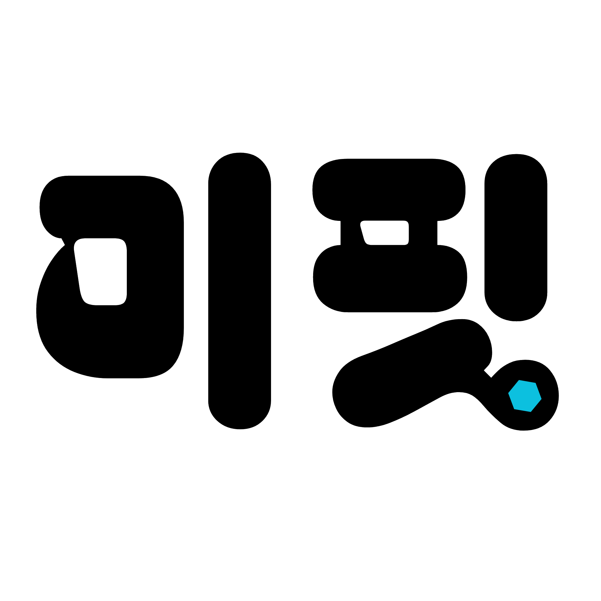
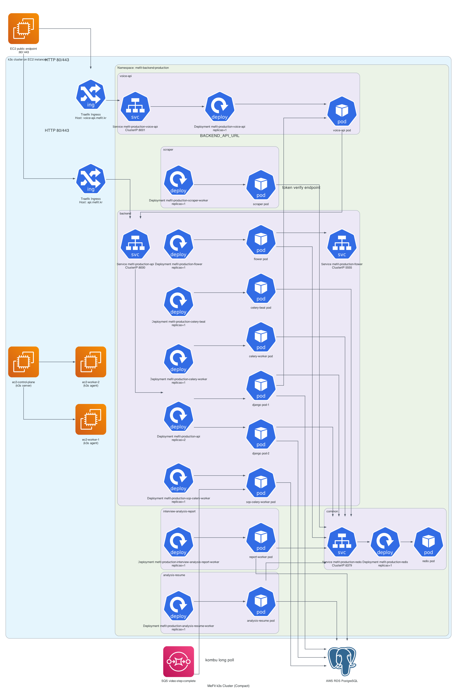
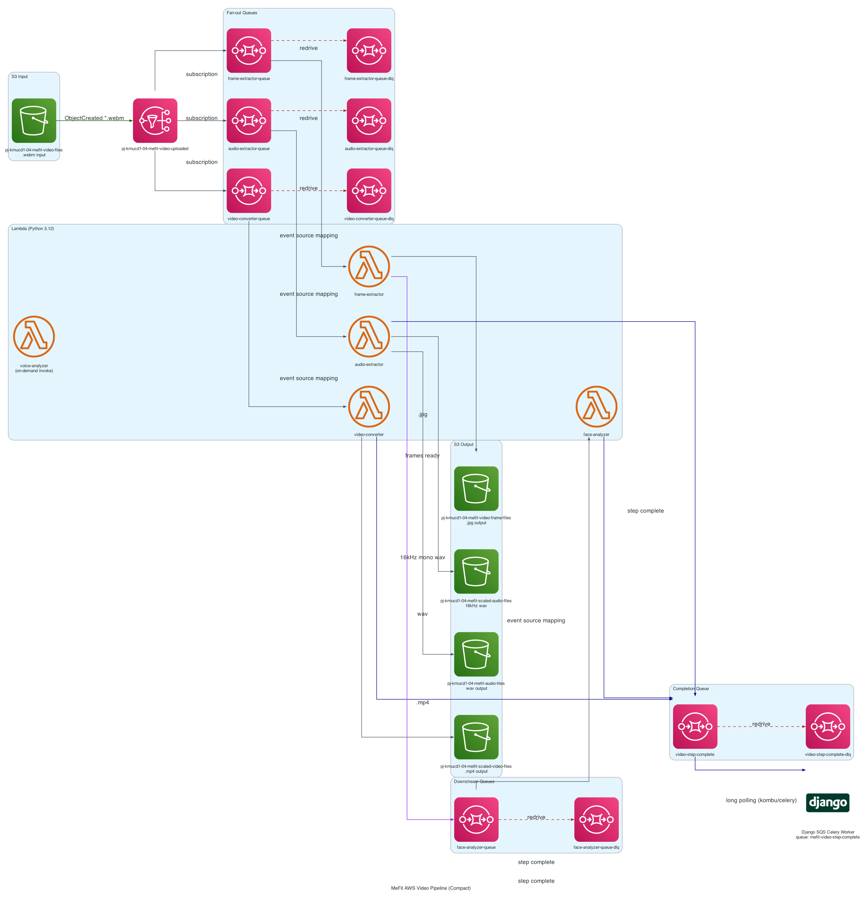

[](https://classroom.github.com/a/Lvs6kcL8)

<div align="center">

<a href="https://mefit.kr">
  
</a>

<br/>

### 未fit, meFit. 면접의 기회는 평등해야 합니다.

이력서와 채용공고를 기반으로 AI가 실제 면접관처럼 질문하고, 음성·영상·표정까지 분석해주는 자기주도 AI 가상 면접 트레이너.

<br/>

[](https://mefit.kr)
[](https://api.mefit.kr)
[](https://kookmin-sw.github.io/2026-capstone-54/)

[](#-팀)
[](https://cs.kookmin.ac.kr/)
[](#-마이크로서비스-12개-모듈)
[](#-라이선스)

</div>

---

## 📑 목차

1. [한 줄 요약](#-한-줄-요약)
2. [우리가 푸는 문제](#-우리가-푸는-문제)
3. [핵심 가치](#-핵심-가치)
4. [핵심 기능](#-핵심-기능)
5. [사용자 페르소나](#-사용자-페르소나)
6. [시스템 아키텍처](#-시스템-아키텍처)
7. [마이크로서비스](#-마이크로서비스-12개-모듈)
8. [기술 스택](#-기술-스택)
9. [정량 목표 (KPI)](#-정량-목표-kpi)
10. [시작하기](#-시작하기)
11. [레포지토리 구조](#-레포지토리-구조)
12. [팀](#-팀)
13. [라이선스](#-라이선스)

---

## 🎤 한 줄 요약

> **이력서 & 채용공고 기반 면접 진행 및 피드백이 진행되는 자기주도형 면접 트레이닝 서비스.**

미핏은 사용자가 자신의 이력서와 지원하고자 하는 채용공고를 등록하면, AI가 두 정보를 결합해 실제 면접관처럼 맞춤형 질문을 생성하고, 사용자의 답변을 **Audio / Video / Transcript** 데이터로 추출하여 분석 후 종합 분석 리포트를 제공하는 가상 면접 플랫폼입니다.

> *"이력서와 채용공고만으로 자기주도 면접을 무한히 반복하고 싶은 모든 구직자를 위한,*
> *실제 면접관처럼 질문하고 점수를 매겨주는 AI 기반 가상 면접 시뮬레이션 플랫폼, MeFit을 개발한다."*

---

## 🎯 우리가 푸는 문제

> 한국의 신입 채용 시장에서 면접은 **합격을 결정짓는 가장 큰 변수**입니다.
> 그러나 동시에 **가장 연습하기 어려운 단계**이기도 합니다.

| 단계 | 일반적 횟수 | 비고 |
|---|---|---|
| 서류 작성 | 수십 ~ 수백 회 | 본인 노트북에서 무한 반복 가능 |
| 자기소개서 첨삭 | 수회 ~ 수십 회 | 학교 / 친구 / 유료 첨삭 서비스 활용 |
| **모의면접** | **0 ~ 2 회** | 학교 / 유료 기관 자원 의존, 매칭 실패 빈번 |
| **실전 면접** | 통상 1 ~ 2 회 | 합격을 결정짓는 최종 단계 |

> 서류·자소서는 무한히 다듬을 수 있는 반면, **면접은 본인의 답변을 본인이 들어볼 기회 자체가 거의 없는 상태**에서 실전에 들어가게 됩니다. 결과적으로 다수의 구직자는 *"실전에서 처음 말해 보는 답변"* 이라는 구조적 비대칭에 노출됩니다.

### 일반 AI 챗봇 vs 미핏

| 차이점 | 일반 AI 챗봇 | **meFit** |
|---|:---:|:---:|
| 본인 이력서를 학습하는가 | ✗ | ✅ |
| 본인 지원 공고를 학습하는가 | ✗ | ✅ |
| 음성·영상·표정을 함께 분석하는가 | ✗ | ✅ |
| 학습 루프(스트릭/업적/티켓)가 있는가 | ✗ | ✅ |

> **결정적 격차** — *"이력서와 채용공고를 모두 알고, 답변을 Audio, Video, Transcript로 나누어 분석하며, 후속 질문까지 만들어 주는 자기주도 면접 트레이닝 플랫폼이 시장에 아직 자리잡지 못했다."*

---

## 💎 핵심 가치 *(§1.1.3)*

| | 가치 | 설명 |
|:---:|---|---|
| 🎯 | **개인 맞춤** | 사용자 이력서 + 사용자 지원 공고 기반 질문 생성 |
| 📊 | **정량 피드백** | 5개 카테고리 점수 + 음성 분석 + 모범 답안 |
| 🔁 | **무한 반복** | 장소 제약 없이 매일 / 매시간 연습 가능 |
| 🏆 | **스트릭 / 업적 티켓 보상** | 스트릭 / 업적 달성으로 티켓 보상을 지급하고 긍정적 학습 루프 형성 |

---

## ✨ 핵심 기능

<table>
<tr>
<td width="33%" valign="top">

### 1️⃣  이력서 + 채용공고 분석

> 본인의 이력과 지원 공고를 결합한 맞춤형 질문.

PDF / DOCX 업로드 또는 텍스트 입력 → **섹션 단위 Chunking** → LangChain + Pydantic 스키마로 LLM 구조화 분석 → **벡터 임베딩 생성** → 면접 질문 생성에 직접 활용.

`LangChain` `pdfplumber`<br/>
`python-docx` `Pydantic`

</td>
<td width="33%" valign="top">

### 2️⃣  꼬리질문 / 풀 프로세스 면접

> 답변 안의 키워드를 잡아 **다음 질문**을 자동 생성하는 면접관.

- **FOLLOWUP** — 답변에서 새 키워드를 잡아 후속 질문 생성
- **FULL_PROCESS** — 인사 → 자기소개 → 직무질문 → 마무리

`EASY` `MEDIUM` `HARD`<br/>
`친근` `일반` `압박` 페르소나

</td>
<td width="33%" valign="top">

### 3️⃣  종합 분석 리포트

> 5개 카테고리 점수 — 답변 내용뿐 아니라 음성·표정까지 통합 평가.

**구체성 / 직무 적합성 / 논리성 / 신뢰도 / 면접태도** 5 카테고리 점수 + 음성 지표 (속도 / 필러 / 침묵 / 음량) + 표정 4분류 (긍정 / 부정 / 중립 / 미감지) + 카테고리별 strengths / improvements / model_answer.

`faster-whisper` `MediaPipe`<br/>
`GPT-4o` `Hypothesis`

</td>
</tr>
</table>

### 부가 기능

🔥 **스트릭 & 도전과제** (게이미피케이션) ・ 📧 **이메일 알림** (인증 / 리포트 완료) ・ 🎟️ **티켓 재화** (Free / Pro 플랜) ・ 🪞 **풀스크린 가드** (몰입 면접 환경)

---

## 👤 사용자 페르소나

| 페르소나 | 페인 포인트 | 사용 패턴 |
|---|---|---|
| **김취준** (24, 신입 취준생) | "면접 자체를 처음 본다" / 학교 모의면접은 학기당 1 회만 매칭 | 본인 이력서 + 지원한 회사 채용공고 등록 → FOLLOWUP 모드 → 매일 점수 추적 |
| **이이직** (29, 이직 직장인) | 마케팅 3년 차, 데이터 분석 직무 전환 — 답변 프레이밍 어려움 | 마케팅 경력 이력서 + 데이터 분석 채용공고 → FULL_PROCESS 모드 |
| **박코치** (40, 부트캠프 강사) | 수강생 50명 1:1 모의면접을 인력으로 감당 불가 | 수강생에게 MeFit 권장 → 분석 리포트를 코칭 자료로 활용 |

---

## 🏗️ 시스템 아키텍처

<table>
<tr>
<td width="50%" align="center" valign="top">



**☸️ k3s on EC2 클러스터**

컨트롤 플레인 + 워커 노드 · Traefik Ingress<br/>
도메인별 Celery 큐 분리 · 무중단 배포

</td>
<td width="50%" align="center" valign="top">



**☁️ AWS 이벤트 파이프라인**

S3 → SNS → SQS Fan-out → Lambda 5종<br/>
모든 SQS DLQ 로 장애 격리

</td>
</tr>
</table>

<div align="center">

📐 **[전체 통합 인프라 다이어그램 보기 →](mefit-diagrams/full_infrastructure_compact.png)**
*(12개 마이크로서비스 + k3s 클러스터 + AWS 이벤트 파이프라인 통합 구성도)*

</div>

---

## 🧩 마이크로서비스 (12개 모듈)

| # | 모듈 | 역할 | 핵심 기술 |
|:--:|---|---|---|
| 1 | [`backend`](backend/) | Django REST 기반 메인 API 서버 · 13개 도메인 앱 · WebSocket / SSE | Django 6 · DRF · Celery · Channels |
| 2 | [`frontend`](frontend/) | React SPA · 28 페이지 · Feature-Sliced Design 6 layer | React 19 · Vite · Bun · Tailwind 4 |
| 3 | [`scraping`](scraping/) | 채용공고 URL → 구조화 정보 자동 추출 Worker · Plugin 구조 · 2단계 Fallback | Celery · Playwright · httpx · LLM |
| 4 | [`analysis-resume`](analysis-resume/) | 이력서 LLM 분석 + 벡터 임베딩 Worker · 섹션 Chunking | LangChain · pdfplumber · python-docx · Pydantic |
| 5 | [`interview-analysis-report`](interview-analysis-report/) | 면접 분석 리포트 Worker · 5단계 파이프라인 (Loader → VoiceAnalysisInvoker → AnalysisContext.build → LLMAnalyzer → Repository.save) | LangChain · Pydantic · Hypothesis |
| 6 | [`analysis-stt`](analysis-stt/) | 음성 인식 Worker · faster-whisper small/int8 · CPU 한국어 디코딩 · Singleton 모델 | faster-whisper · Celery · S3 |
| 7 | [`analysis-video`](analysis-video/) | **AWS Lambda 4종** — video-converter / frame-extractor / audio-extractor / voice-analyzer | AWS Lambda · ffmpeg · S3 · SNS · SQS |
| 8 | [`face-analyzer`](face-analyzer/) | **AWS Lambda 1종** — MediaPipe Face Landmarker로 표정 4분류 (긍정 / 부정 / 중립 / 얼굴 미감지) | MediaPipe · numpy · AWS Lambda |
| 9 | [`voice-api`](voice-api/) | TTS 음성 합성 서버 · audio/mpeg 스트리밍 · Stateless · Bearer JWT 위임 | FastAPI · edge-tts (14언어 322 voices) |
| 10 | [`infra`](infra/) | k3s 다중 노드 클러스터 운영 · Traefik Ingress · `deploy.sh` 한 줄 무중단 배포 / 롤백 | k3s · Traefik · GitHub Actions |
| 11 | [`mefit-tools`](mefit-tools/) | 로컬 개발 환경 관리 GUI · Docker Compose 통합 제어 · 1명령어 부팅 | Streamlit · Docker Compose |
| 12 | [`mefit-diagrams`](mefit-diagrams/) | 모든 설계 다이어그램의 코드 관리 (Component / Activity / State / Sequence) | PlantUML · Python diagrams |

> [!TIP]
> 각 모듈은 **독립 Dockerfile + Deployment 매니페스트**로 단독 배포 가능하며,
> 도메인별 Celery 큐 분리 + 모든 SQS DLQ 로 **장애 격리**가 보장됩니다.

---

## 🛠️ 기술 스택

**Frontend**


**Backend**


**AI / ML**


**Infra (AWS · k3s)**


**Observability**


**CI/CD · DevOps**


---

## 📊 정량 목표 (KPI)

### Tier 1 — 응답성 / 성능

| 지표 | 목표값 | 측정 위치 |
|---|---|---|
| 페이지 초기 로드 시간 | ≤ **3초** (FCP) | Lighthouse / WebPageTest |
| API 평균 응답 시간 (조회) | ≤ **200 ms** | Django Middleware / Flower |
| LLM 첫 질문 생성 시간 | ≤ **5초** (gpt-4o-mini, 한국어 첫 토큰) | TokenUsage 기록 |
| 영상 청크 업로드 처리 | ≤ **1초/청크** (S3 멀티파트) | Frontend `useChunkUploader` |
| 분석 리포트 생성 시간 | ≤ **2분** (질문 5~10개) | InterviewAnalysisReport 통계 |
| Lambda 콜드 스타트 | ≤ **5초** (Python 3.14, ffmpeg Layer) | CloudWatch Lambda Insights |

### Tier 2 — 신뢰성 / 확장성 / 비용

| 지표 | 목표값 |
|---|---|
| Pod 재시작 발생률 | < 1회 / 일 |
| Lambda 실패율 | < 0.1 % (DLQ 진입 기준) |
| Celery 태스크 실패율 | < 1 % (재시도 후) |
| 동시 사용자 수 (피크) | ≥ 50 |
| 일일 면접 세션 수 | ≥ 100 |
| 일일 LLM 호출 수 | ≥ 1,000 (분석 / 후속 질문 / 평가 합산) |
| **한 면접 세션당 LLM 비용** | ≤ ₩200 (gpt-4o-mini 우선 사용) |
| **월 운영 인프라 비용** | ≤ ₩100,000 (캡스톤 지원 인프라 한도 내) |

---

## 🚀 시작하기

### 사용자

1. **[`https://mefit.kr`](https://mefit.kr)** 방문 → 회원가입 → 이메일 인증 → 직무 / 경력 입력
2. **이력서** 업로드 (PDF / DOCX) 또는 텍스트 입력
3. 지원하려는 **채용공고 URL** 입력 또는 직접 입력
4. **면접 모드 + 난이도** 선택 → Precheck (카메라 / 마이크 / 풀스크린) → 면접 시작
5. 면접 종료 → **분석 리포트** 자동 생성 → 5 카테고리 점수 + 음성 / 표정 분석 확인

### 개발자

```bash
# 1. 클론 + 서브모듈 초기화
git clone https://github.com/kookmin-sw/2026-capstone-54.git
cd 2026-capstone-54
git submodule update --init --recursive

# 2. 로컬 환경 부팅 (mefit-tools)
cd mefit-tools
make up-all      # 모든 서비스 한 번에
# 또는
make gui-up      # Streamlit GUI 로 제어
```

> 자세한 운영 방법은 각 모듈의 `README.md`를 참고하세요.

---

## 📂 레포지토리 구조

```text
2026-capstone-54/
├── 🎨 frontend/                     React 19 + Vite + Tailwind 4
├── ⚙️  backend/                      Django 6 메인 API + WebSocket/SSE
├── 📄 analysis-resume/              이력서 LLM 분석 / 임베딩 Worker
├── 🎙️  analysis-stt/                 faster-whisper STT Worker
├── 🎬 analysis-video/               AWS Lambda 4종 (영상 처리 파이프라인)
├── 😀 face-analyzer/                AWS Lambda 1종 (MediaPipe 표정 분석)
├── 📊 interview-analysis-report/    면접 종합 분석 리포트 Worker
├── 🔊 voice-api/                    edge-tts FastAPI TTS 서버
├── 🕸️  scraping/                     채용공고 URL → 구조화 정보 추출 (Plugin + Fallback)
├── ☸️  infra/                        k3s 매니페스트 + Traefik + deploy.sh + CI/CD
├── 🧰 mefit-tools/                  로컬 개발 환경 GUI/CLI (Streamlit)
├── 📐 mefit-diagrams/               PlantUML / Python diagrams 코드
├── 🌐 github-page/                  React 인터랙티브 팀 페이지 (별도 브랜치 호스팅)
│
├── _config.yml                      GitHub Pages 설정
├── index.md                         GitHub Pages 진입점
└── README.md                        본 파일
```

---

## 👥 팀

<table>
<tr>
<td align="center" width="25%">
<a href="https://github.com/shinkeonkim">
<br/>
<sub><b>김신건 (조장)</b></sub>
</a><br/>
<sub>PM · Architect</sub><br/>
<sub><code>전체 아키텍처</code></sub><br/>
<sub><code>AI · Infra · Backend</code></sub>
</td>
<td align="center" width="25%">
<a href="https://github.com/sonnyseokjun">
<br/>
<sub><b>김석준</b></sub>
</a><br/>
<sub>Backend</sub><br/>
<sub><code>Django · 채용공고</code></sub><br/>
<sub><code>표정 분석 파이프라인</code></sub>
</td>
<td align="center" width="25%">
<a href="https://github.com/youzinnnnn">
<br/>
<sub><b>김유진</b></sub>
</a><br/>
<sub>Backend</sub><br/>
<sub><code>Django · 면접 질문</code></sub><br/>
<sub><code>분석 파이프라인</code></sub>
</td>
<td align="center" width="25%">
<a href="https://github.com/joan4720">
<br/>
<sub><b>이주현</b></sub>
</a><br/>
<sub>Frontend</sub><br/>
<sub><code>Frontend 개발</code></sub><br/>
<sub><code>디자인 전반</code></sub>
</td>
</tr>
</table>

---

## 🌱 비전

> **"채용 시장의 정보 비대칭과 면접 기회 부족을, AI 로 모두에게 평등하게 풀어준다."**
>
> 지방 / 비명문대 / 비전공 직무 전환자처럼 오프라인 모의면접에 접근하기 어려운 구직자도,
> 시간과 장소에 구애받지 않고 *"실전 같은 면접 → 정량 피드백 → 개선"* 사이클을 무한히 반복할 수 있게 만드는 것이 본 프로젝트의 궁극적 목표입니다.
>
> 이를 통해 *"면접 정보는 더 이상 선배 네트워크의 자산이 아니다"* 라는 사회적 가치를 함께 실현하고자 합니다.

---

## 📜 라이선스

MIT License © 2026 meFit · 국민대학교 SW캡스톤 2026 · 54팀

본 저장소는 국민대학교 소프트웨어융합대학 소프트웨어학부 다학제간캡스톤디자인 I 의 결과물입니다.

---

<div align="center">

**meFit** · made with 🩵 by [김신건](https://github.com/shinkeonkim) · [김석준](https://github.com/sonnyseokjun) · [김유진](https://github.com/youzinnnnn) · [이주현](https://github.com/joan4720)

[mefit.kr](https://mefit.kr) ・ [api.mefit.kr](https://api.mefit.kr) ・ [Team Page](https://kookmin-sw.github.io/2026-capstone-54/)

</div>
